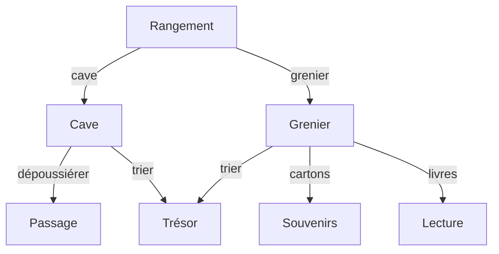

# Projet 1

Le chapitre "Introduction à la programmation" sera évalué sous la forme d'un projet individuel.

## Jeu

Le projet consiste à réaliser un jeu textuel en Python inspiré des livres dont vous êtes le héros. La personne qui joue doit prendre des décisions qui influencent le déroulement de l'histoire.

## Organigramme

Une histoire peut être résumée par un organigramme tel que :

Voici le jeu de l'organigramme ci-dessus : [Le rangement](https://gymnacode.web.app/editor?mode=r&code=eNqVlb1u2zAUhfc8xS0X20Ai7waKDk07dWiBokvRgSGvFAIUyfJHCfw0HeO%2BQWe9WC%2F1Zzly6saDAYmH91x%2BPKQkluC5qbBGE9eb3RXQz3lFD%2BybTQFkexBK4h4kQsmVR5DpOAMkNwEaG%2Bl9zVWwpoDP3INt%2F4CwNUkEenjHNvO6NyBgB584CN7g86EqDyFUHo1CP4yKe6se4S0w1j0%2B3CuNw0tjIygD35lg18Aq9qNfwnyWMi5R7ffd41psq80O2KbQ9gH9ujdQ5agmE8FmNajFQYP6RFXNVEO3JLy6kkS0n7WE2f6OSP%2B%2FQPeLL%2BBLQsKXNO5vmqzoES%2BASaJy2x4cSYJqD34iMykiKb56agI0WfCyKxRewU9mfvEyP7mNF%2FjJGRnHQ%2BDVCwjjTEgJCvZIcCL6EsQueHoKyn%2BT5P%2FidBLQo0pwH61ZiPSJSKvmdcB5Bt6lVl%2Bmzrdiqy9w5%2BdwnsE%2Bz3ewqSGAPpyX6plUo4jJ563sdmja2ZMd%2BmDyjTHllJt4Dc14j5CXp5skGQSHUUWkNrlzdAxO0VIRvcri4%2FToc6N57mgMAYXHCD%2BT6iV1%2B2TQc2jQk92Kp8wA6JSZ3HYoioKN6RrpLMMVbX1HNiH5bCVsWVKIPNZOq3wDOtU%2BiZy%2BlfXPu%2F7IVQ4mGrizBlLX45vJcgZ66UrrGNbnNFI4yGnSkxeaktNFOqs27cWyVsfCaUs39H44JXzUUy1aVaMwPfZ57ZHMPgB%2FAWHe1Rs%3D)

## Journal de bord

La tenue d'un journal de bord fait partie de l'évaluation du projet. Vous y noterez les idées que vous avez, les problèmes rencontrés, les solutions trouvées, etc.

:::warning[Devoir]

Vous avez **deux semaines** pour rendre une première version du journal de bord avec l'organigramme de votre histoire dans les devoirs sur **Teams** au format **PDF**.

:::

- Créer un fichier Word nommé `prenom-nom-journal` (avec votre prénom et nom en minuscule, sans accent et séparé par des tirets).
- Sauvegarder dans le dossier `1m/informatique` de votre **OneDrive** (déjà créé au début de l'année).
- Donner un titre à votre histoire.
- Écrire une brève introduction de votre histoire.
- Mettre l'organigramme de votre histoire.
  - Dessiner sur papier et ajouter un scan ou une photo au document.
  - Ou utiliser un logiciel de dessin (par exemple [Word](https://support.microsoft.com/fr-fr/office/ajouter-un-dessin-%C3%A0-un-document-348a8390-c32e-43d0-942c-b20ad11dea6f) ou [draw.io](https://draw.io/)).
- Voici [un exemple de journal de bord](/tp/projet/david-tang-journal.pdf).
- Rendre le journal de bord sur **Teams** en **PDF**.

### Organigramme

L'organigramme doit satisfaire les critères suivants :

- Au moins 4 embranchements.
- Un embranchement doit contenir au moins 3 choix.
