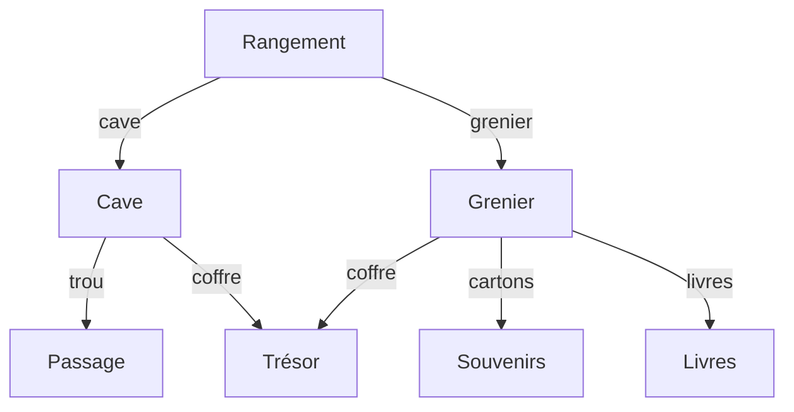

# Aventure

:::note[Objectifs]

Création d'un jeu d'aventure en HTML et CSS.

:::

## Mise en place

- Créer un dossier `web-aventure` dans le répertoire `OneDrive/3cci/informatique`.
  ```txt {4}
  OneDrive/
  └── 3cci/
      └── informatique/
          └── web-aventure/
          └── web-css/
          └── web-html/
  ```
- Ouvrir le dossier `web-aventure` dans Visual Studio Code.

## Aventure

Le but est de créer un jeu d'aventure en HTML et CSS : à chaque étape, le joueur doit choisir entre plusieurs options qui le mèneront à une autre étape.

Une histoire peut être résumée par un organigramme tel que :


