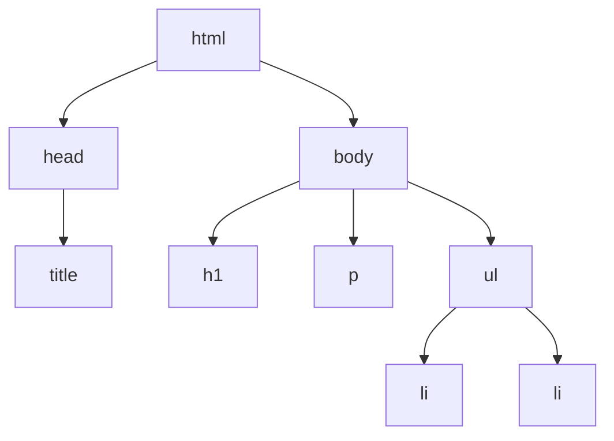
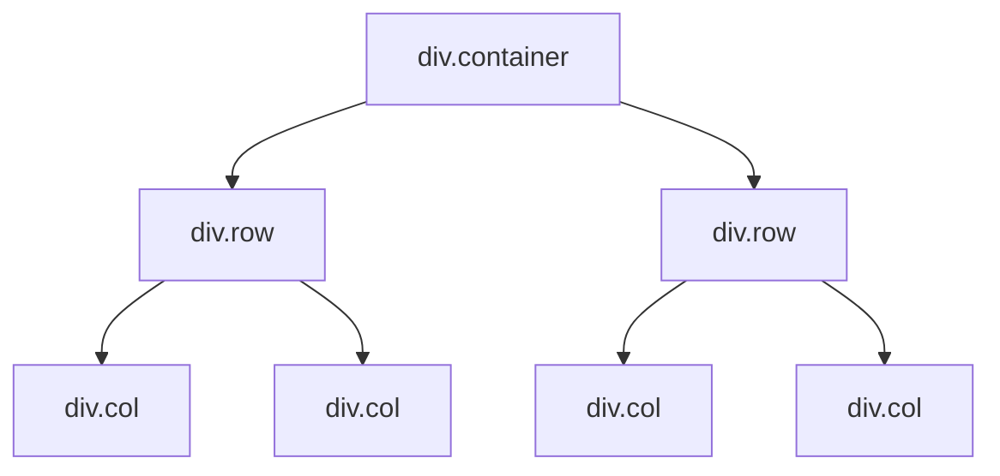

# Révision

:::note[Objectifs]

L'évaluation se portera sur les critères suivants :

- CMS
  - [ ] Critiquer l'utilisation d'un CMS.
  - [ ] Comparer les fonctionnalités de différents CMS.
- Responsive Web Design
  - [ ] Expliquer le concept du Responsive Web Design.
  - [ ] Adapter un site Web pour le rendre responsive.
  - [ ] Formater du code.
- JavaScript
  - [ ] Différencier HTML, CSS et JavaScript.
  - [ ] Expliquer le principe du DOM.
- Python
  - [ ] Utiliser les variables.
  - [ ] Utiliser les boucles.

|            Note            | &nbsp;1&nbsp; | &nbsp;2&nbsp; | 2.5 | &nbsp;3&nbsp; | 3.5 | &nbsp;4&nbsp; | 4.5 | &nbsp;5&nbsp; | 5.5 | &nbsp;6&nbsp; |
| :------------------------: | :-----------: | :-----------: | :-: | :-----------: | :-: | :-----------: | :-: | :-----------: | :-: | :-----------: |
| Nombre de critères validés |       0       |       1       |  2  |       3       |  4  |       5       |  6  |       7       |  8  |       9       |

:::

## CMS

Qu'est-ce qu'un CMS et à quoi sert-il ?

<details>
<summary>Réponse possible</summary>

Un CMS (Content Management System) est un système de gestion de contenu. Il permet de créer, modifier et organiser du contenu sur un site Web sans avoir besoin de connaissances techniques en programmation. Il facilite la gestion de contenu pour les utilisateurs qui n'ont pas de compétences en développement Web.

</details>

Quels sont les avantages et les inconvénients d'un CMS ?

<details>
<summary>Réponse possible</summary>

**Avantages** : Facilité d'utilisation, gain de temps, coût réduit, mises à jour régulières, communauté active, etc.

**Inconvénients** : Personnalisation limitée, performances réduites, sécurité, dépendance vis-à-vis du CMS, etc.

</details>

Quelles sont les différences entre WordPress et Google Sites ?

<details>
<summary>Réponse possible</summary>

WordPress est un CMS open source très populaire, tandis que Google Sites est un outil de création de site Web gratuit et hébergé par Google. WordPress offre plus de fonctionnalités et de personnalisation, mais nécessite un hébergement et une maintenance régulière. Google Sites est plus simple et rapide à utiliser, mais offre moins de flexibilité.

</details>

Expliquer les termes suivants en rapport avec un CMS :

1. Thème
2. Plugin
3. Page
4. Article
5. Catégorie
6. Tag (étiquette)

<details>
<summary>Réponses possibles</summary>

1. Un thème détermine l'apparence d'un site Web. Il permet de personnaliser le design et la mise en page du site global.
2. Un plugin est un module d'extension qui ajoute des fonctionnalités supplémentaires à un site Web. Il permet d'ajouter des fonctionnalités spécifiques codées par quelqu'un d'autre.
3. Une page est une partie statique d'un site Web. Elle est généralement utilisée pour des contenus qui ne changent pas souvent, comme une page "À propos".
4. Un article un contenu avec une date de publication. Il est généralement utilisé pour des contenus qui sont publiés régulièrement, comme des articles de blog.
5. Une catégorie est une manière d'organiser les articles en groupes thématiques. Elle permet de classer les contenus en fonction de leur sujet.
6. Un tag est un mot-clé associé à un article. Il permet de classer les contenus en fonction de leur sujet ou de leur thème.

https://www.mirobolus.fr/quelle-difference-entre-un-article-une-page-une-categorie/

</details>

## Responsive Web Design

Qu'est-ce que le Responsive Web Design ?

<details>
<summary>Réponse possible</summary>

Le Responsive Web Design est une approche de conception Web qui vise à créer des sites Web qui s'adaptent automatiquement à différents appareils et tailles d'écran. Cela permet d'offrir une expérience utilisateur optimale sur tous les appareils, du smartphone à l'ordinateur de bureau.

</details>

### Adapter un site Web

Utiliser le système de grille de Bootstrap pour agencer les éléments comme demandé sur différentes tailles d'écran.

```html
<div>A</div>
<div>B</div>
<div>C</div>
<div>D</div>
```

Pour tous les écrans :

```kroki type=svgbob
+---------------------------------+
| .-----. .-----. .-----. .-----. |
| |  A  | |  B  | |  C  | |  D  | |
| '-----' '-----' '-----' '-----' |
+---------------------------------+
```

<details>
<summary>Solution possible</summary>

```html
<div class="row">
  <div class="col">
    <div>A</div>
  </div>
  <div class="col">
    <div>B</div>
  </div>
  <div class="col">
    <div>C</div>
  </div>
  <div class="col">
    <div>D</div>
  </div>
</div>
```

[CodePen](https://codepen.io/blueur/pen/zxOqavX?editors=1000)

</details>

Pour tous les écrans :

```kroki type=svgbob
+---------------------------------+
| .-------------. .-----. .-----. |
| |      A      | |  B  | |  C  | |
| '-------------' '-----' '-----' |
| .---------------------.         |
| |          D          |         |
| '---------------------'         |
+---------------------------------+
```

<details>
<summary>Solution possible</summary>

```html
<div class="row">
  <div class="col-6">
    <div>A</div>
  </div>
  <div class="col-3">
    <div>B</div>
  </div>
  <div class="col-3">
    <div>C</div>
  </div>
  <div class="col-9">
    <div>D</div>
  </div>
</div>
```

[CodePen](https://codepen.io/blueur/pen/VYZaGOY?editors=1000)

</details>

Sur écran `md` et moins :

```kroki type=svgbob
+-----------------+
| .-----. .-----. |
| |  A  | |  B  | |
| '-----' '-----' |
| .-----. .-----. |
| |  C  | |  D  | |
| '-----' '-----' |
+-----------------+
```

Sur écran `md` et plus :

```kroki type=svgbob
+-----------------+
| .-------------. |
| |      A      | |
| '-------------' |
| .-----. .-----. |
| |  B  | |  C  | |
| '-----' '-----' |
| .-----.         |
| |  D  |         |
| '-----'         |
+-----------------+
```

<details>
<summary>Solution possible</summary>

```html
<div class="row">
  <div class="col-6 col-md-12">
    <div>A</div>
  </div>
  <div class="col-6">
    <div>B</div>
  </div>
  <div class="col-6">
    <div>C</div>
  </div>
  <div class="col-6">
    <div>D</div>
  </div>
</div>
```

[CodePen](https://codepen.io/blueur/pen/ogvxagg?editors=1000)

</details>

Sur écran `sm` et moins :

```kroki type=svgbob
+-----------------+
| .-------------. |
| |      A      | |
| '-------------' |
| .-------------. |
| |      B      | |
| '-------------' |
| .-----. .-----. |
| |  C  | |  D  | |
| '-----' '-----' |
+-----------------+
```

Sur écran entre `sm` et `lg` :

```kroki type=svgbob
+-----------------+
| .-----. .-----. |
| |  A  | |  B  | |
| '-----' '-----' |
| .-----. .-----. |
| |  C  | |  D  | |
| '-----' '-----' |
+-----------------+
```

Sur écran `lg` et plus :

```kroki type=svgbob
+-------------------------+
| .-----. .-----. .-----. |
| |  A  | |  B  | |  C  | |
| '-----' '-----' '-----' |
| .---------------------. |
| |          D          | |
| '---------------------' |
+-------------------------+
```

<details>
<summary>Solution possible</summary>

```html
<div class="row">
  <div class="col-12 col-sm-6 col-lg-4">
    <div>A</div>
  </div>
  <div class="col-12 col-sm-6 col-lg-4">
    <div>B</div>
  </div>
  <div class="col-6 col-lg-4">
    <div>C</div>
  </div>
  <div class="col-6 col-lg-12">
    <div>D</div>
  </div>
</div>
```

[CodePen](https://codepen.io/blueur/pen/XJrdxdG?editors=1000)

</details>

## JavaScript

### DOM

Dessiner le DOM pour le code HTML suivant :

```html
<!doctype html>
<html>
  <head>
    <title>Exemple</title>
  </head>
  <body>
    <h1>Titre</h1>
    <p>Paragraphe</p>
    <ul>
      <li>Élément 1</li>
      <li>Élément 2</li>
    </ul>
  </body>
</html>
```

<details>
<summary>Solution</summary>



</details>

### Format + DOM

Formatter le code suivant pour qu'il soit correctement indenté :

<!-- prettier-ignore-start -->

```html
<div class="container"><div class="row">
  <div class="col">Colonne 1
</div>
    <div class="col">Colonne 2</div></div>
<div class="row">
    <div class="col">Colonne 3</div><div class="col">
      Colonne 4</div></div></div>
```

<!-- prettier-ignore-end -->

<details>
<summary>Solution</summary>

```html
<div class="container">
  <div class="row">
    <div class="col">Colonne 1</div>
    <div class="col">Colonne 2</div>
  </div>
  <div class="row">
    <div class="col">Colonne 3</div>
    <div class="col">Colonne 4</div>
  </div>
</div>
```

</details>

Dessiner le DOM du code HTML précédent.

<details>
<summary>Solution</summary>



</details>

1. Quel est le parent de `Colonne 3` ?
2. Quels sont les enfants de `.container` ?
3. Quels sont les voisins de `Colonne 2` ?

<details>
<summary>Réponses</summary>

1. Le deuxième `div.row`.
2. Les deux `div.row`.
3. `Colonne 1`.

</details>

## Python

### Variable

Que vont imprimer les programmes suivants ?

```python
a = 5
b = 3
print(b)
print(a)
print(a + b)
```

<details>
<summary>Solution</summary>

```
3
5
8
```

</details>

```python
a = 2
print(a)
a = a + 3
print(a)
b = a * 2
print(b)
a = 4
print(a, b)
```

<details>
<summary>Solution</summary>

```
2
5
10
4 10
```

</details>

### Boucle

Que vont imprimer les programmes suivants ?

```python
for i in range(4):
    print("Bonjour")
```

<details>
<summary>Solution</summary>

```
Bonjour
Bonjour
Bonjour
```

</details>

```python
for i in range(3):
    print(i)
```

<details>
<summary>Solution</summary>

```
0
1
2
```

</details>

```python
for i in range(6):
    a = i * 2
    print(a, i)
```

<details>
<summary>Solution</summary>

```
0 0
2 1
4 2
6 3
8 4
10 5
```

</details>

```python
for i in range(10):
    print("4 x", i, "=", 4 * i)
```

<details>
<summary>Solution</summary>

```
4 x 0 = 0
4 x 1 = 4
4 x 2 = 8
4 x 3 = 12
4 x 4 = 16
4 x 5 = 20
4 x 6 = 24
4 x 7 = 28
4 x 8 = 32
4 x 9 = 36
```

</details>

:::tip[Console]

Tester du code Python en ligne : https://www.algopython.fr/outil/console

:::
