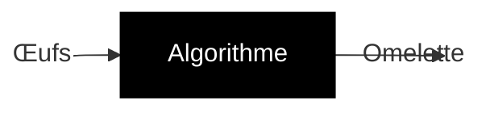
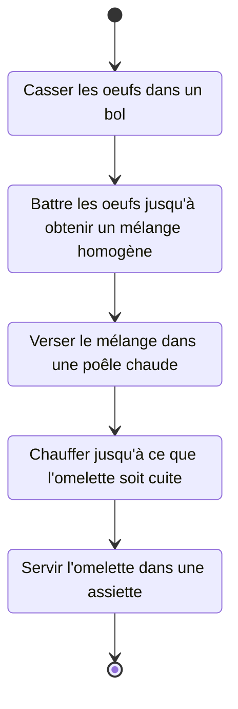
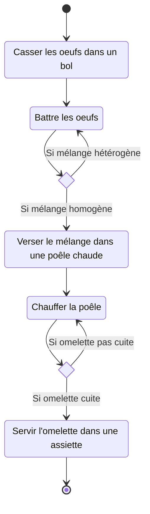

# Organigramme

Introduction à l'algorithmique

---

## Algorithme

&shy;<!-- .element: class="fragment" --> Un algorithme est une suite **finie** et **non ambiguë** d'opérations ou d'**instructions** permettant de résoudre un **problème** ou d'obtenir un **résultat**.

- &shy;<!-- .element: class="fragment" --> Résoudre un problème
  - &shy;<!-- .element: class="fragment" --> Entrée(s)
  - &shy;<!-- .element: class="fragment" --> Sortie(s)
- &shy;<!-- .element: class="fragment" --> Algorithmique
  - &shy;<!-- .element: class="fragment" --> Domaine d'étude des algorithmes

---

### Comment faire une omelette ?

- Entrée(s)
  - &shy;<!-- .element: class="fragment" --> Œufs
- Sortie(s)
  - &shy;<!-- .element: class="fragment" --> Omelette



---

#### Algorithme d'une omelette

1. &shy;<!-- .element: class="fragment" --> Casser les oeufs dans un bol
2. &shy;<!-- .element: class="fragment" --> Battre les oeufs jusqu'à obtenir un mélange homogène
3. &shy;<!-- .element: class="fragment" --> Verser le mélange dans une poêle chaude
4. &shy;<!-- .element: class="fragment" --> Chauffer jusqu'à ce que l'omelette soit cuite
5. &shy;<!-- .element: class="fragment" --> Servir l'omelette dans une assiette

&nbsp;

&shy;<!-- .element: class="fragment" --> **Plusieurs** algorithmes possibles pour résoudre un **même** problème

---

### Organigramme

&shy;<!-- .element: class="fragment" --> Un organigramme est une **représentation graphique** d'un algorithme.

---

### Organigramme d'une omelette



---

### Organigramme d'une omelette avec des conditions



---

#### Algorithmes CORFA

 <!-- .element: class="full" -->

https://es-asur.ch/corfa <!-- .element: class="reference" -->

---

### Exécution d'un algorithme

- &shy;<!-- .element: class="fragment" --> **Instance** : exécution d'un algorithme pour des entrées données

---

#### Max(a, b) <!-- .element: class="fragment" data-fragment-index="5" -->

```kroki plantuml half
:Entrées : a, b;
if (a < b ?) then (vrai)
  :Retourner b;
  kill
else (faux)
  :Retourner a;
  kill
endif
```

- &shy;<!-- .element: class="fragment" data-fragment-index="1" --> Instance : a = 5, b = 3 ? <span class="fragment" data-fragment-index="2">Résultat : 5</span>
- &shy;<!-- .element: class="fragment" data-fragment-index="3" --> Instance : a = 2, b = 4 ? <span class="fragment" data-fragment-index="4">Résultat : 4</span>

---

#### Somme(n) <!-- .element: class="fragment" data-fragment-index="5" -->

<div class="columns">
<div>

```kroki plantuml full
:Entrée : n;
:résultat ← 0
i ← 1;
while (i ≤ n ?) is (vrai)
  :résultat ← résultat + i
  i ← i + 1;
endwhile (faux)
:Retourner résultat;
kill​
```

</div>
<div>

- &shy;<!-- .element: class="fragment" data-fragment-index="1" --> Instance : n = 0 ? <span class="fragment" data-fragment-index="2">Résultat : 0</span>
- &shy;<!-- .element: class="fragment" data-fragment-index="3" --> Instance : n = 2 ? <span class="fragment" data-fragment-index="4">Résultat : 3</span>

</div>
</div>
