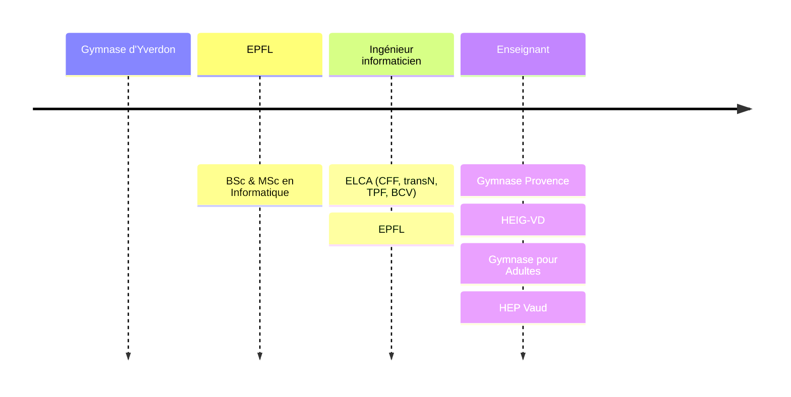

# Informatique 1M

David Tang

---

## Parcours

---

## Organisation

- **Cours**
  - 1 période / semaine
  - Sans ordinateur (débranché)
- **Travaux pratiques**
  - 2 périodes / 2 semaines
  - En demi-classe avec ordinateur

---

## Présence

- &shy;<!-- .element: class="fragment" --> **Retard**
  - Être **prêt·e** à suivre le cours à la **sonnerie**
- &shy;<!-- .element: class="fragment" --> **Absence**
  - À partir de quinze minutes de retard
  - &shy;<!-- .element: class="fragment" --> Être responsable du **rattrapage**
  - &shy;<!-- .element: class="fragment" --> Possibilité de venir au **TP** (pas votre groupe)
- &shy;<!-- .element: class="fragment" --> **Prévenir** par mail en cas d'**absence**
  - &shy;<!-- .element: class="fragment" --> Sinon pas de rattrapage de test

---

## Prise de notes

- &shy;<!-- .element: class="fragment" --> **Supports** mis à disposition
- &shy;<!-- .element: class="fragment" --> Prendre des notes pour **compléter** les diapositives

---

## Contenu

[Plan d'études](https://www.vd.ch/fileadmin/user_upload/organisation/dfj/dgep/dgep_fichiers_pdf/DGEP_brochure_EM_web.pdf)

- &shy;<!-- .element: class="fragment" --> Représentation de l'**information**
- &shy;<!-- .element: class="fragment" --> Introduction à l'**algorithmique**
- &shy;<!-- .element: class="fragment" --> Introduction à la **programmation**
- &shy;<!-- .element: class="fragment" --> Architecture des **ordinateurs**
- &shy;<!-- .element: class="fragment" --> Enjeux de **société**

---

## Outils

- Premier **TP** : avoir ses **identifiants** (photo)
- &shy;<!-- .element: class="fragment" --> Microsoft 365
  - Outlook, Teams, OneDrive, SharePoint, Word, Excel, PowerPoint, OneNote
- &shy;<!-- .element: class="fragment" --> **Téléphones** interdits
  - Sauf pour les quiz et les supports de cours

---

## Teams

- &shy;<!-- .element: class="fragment" --> Poser les **questions générales** sur Teams
  - Réponses pour **toute** la classe
- &shy;<!-- .element: class="fragment" --> **Supports de cours** spécifiques à la classe
  - Groupes de TP
  - Notes

---

## [gymnase.davidtang.ch](https://gymnase.davidtang.ch/)

- &shy;<!-- .element: class="fragment" --> **Calendrier**
  - Dates des **tests**
- &shy;<!-- .element: class="fragment" --> **Supports** de cours
- &shy;<!-- .element: class="fragment" --> **Enregistrer** le lien
  - Ajouter à l'écran d'accueil
  - Ajouter aux favoris
