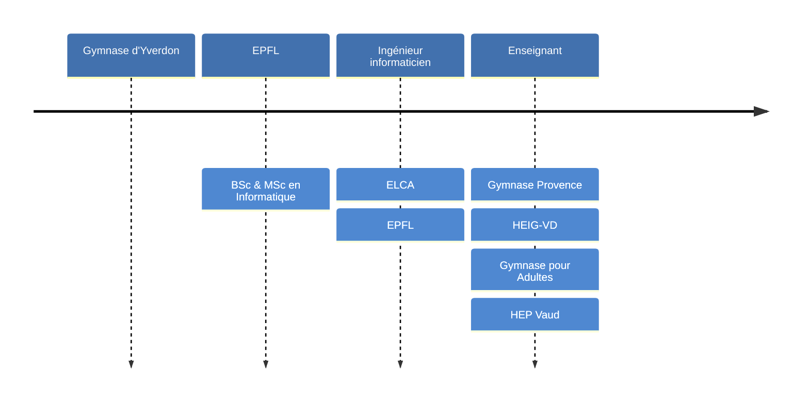

# Informatique

David Tang

---

## Parcours

---

## Organisation

- &shy;<!-- .element: class="fragment" --> **Cours**
  - 1 période / semaine
  - Sans ordinateur (débranché)
- &shy;<!-- .element: class="fragment" --> **Travaux pratiques**
  - 2 périodes / 2 semaines
  - En demi-classe avec ordinateur

---

## Présence

- &shy;<!-- .element: class="fragment" --> Être **prêt·e** à suivre le cours à la **sonnerie**
- &shy;<!-- .element: class="fragment" --> **Prévenir** par mail en cas d'**absence**
  - &shy;<!-- .element: class="fragment" --> Sinon pas de rattrapage

---

## Prise de notes

- &shy;<!-- .element: class="fragment" --> **Supports** mis à disposition
- &shy;<!-- .element: class="fragment" --> Prendre des notes pour **compléter** les diapositives

---

## Contenu

[Plan d'études](https://www.vd.ch/fileadmin/user_upload/organisation/dfj/dgep/dgep_fichiers_pdf/DGEP_brochure_EM_web.pdf) <!-- .element: target="_blank" -->

- &shy;<!-- .element: class="fragment" --> Représentation de l'**information**
- &shy;<!-- .element: class="fragment" --> Introduction à l'**algorithmique**
- &shy;<!-- .element: class="fragment" --> Introduction à la **programmation**
- &shy;<!-- .element: class="fragment" --> Architecture des **ordinateurs**
- &shy;<!-- .element: class="fragment" --> Enjeux de **société**

---

## Teams

- &shy;<!-- .element: class="fragment" --> Poser les **questions générales** sur Teams
  - Réponses pour **toute** la classe
- &shy;<!-- .element: class="fragment" --> **Supports de cours** spécifiques à la classe
  - Groupes de TP
  - Notes

---

## [gymnase.davidtang.ch](https://gymnase.davidtang.ch/) <!-- .element: target="_blank" -->

- &shy;<!-- .element: class="fragment" --> **Calendrier**
  - Dates des **tests**
- &shy;<!-- .element: class="fragment" --> **Supports** de cours
- &shy;<!-- .element: class="fragment" --> **Enregistrer** le lien sur le téléphone
  - Ajouter à l'écran d'accueil
  - Ajouter aux favoris
