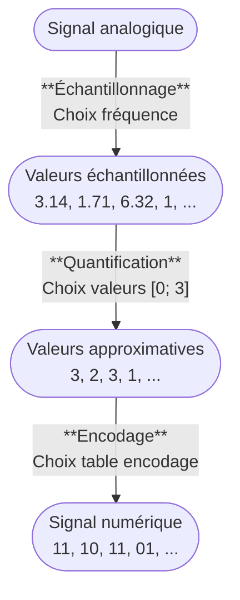

# Son

Représentation de l'information

---

## Analogique vs Numérique

---

## Analogique vs Numérique

- **Analogique**
  - &shy;<!-- .element: class="fragment" --> **Continu** (infinité de valeurs)
  - &shy;<!-- .element: class="fragment" --> Valeurs **réelles**
- **Numérique**
  - &shy;<!-- .element: class="fragment" --> **Discret** (valeurs limitées)
  - &shy;<!-- .element: class="fragment" --> Valeurs **approximatives**
  - &shy;<!-- .element: class="fragment" --> Exemple : 8 bits = 256 valeurs possibles

---

### Disque vinyle

 <!-- .element: class="full" -->

  <a href="https://commons.wikimedia.org/wiki/File:140405_Wega-Dual-300-01.jpg">BlueBreezeWiki</a>, <a href="https://creativecommons.org/licenses/by-sa/3.0">CC BY-SA 3.0</a>, via Wikimedia Commons

---

### Disque vinyle

 <!-- .element: class="full" -->

&shy;<!-- .element: class="reference" --> https://passionhifivintage.wordpress.com/2013/11/25/principes-et-contraintes-de-la-gravure-stereo-des-disques-vinyles/

---

### CD (Compact Disc)

 <!-- .element: class="full" -->

  <a href="https://commons.wikimedia.org/wiki/File:Cd-en-vrac.jpg">Nclm at fr.wikipedia</a>, <a href="https://creativecommons.org/licenses/by-sa/2.5">CC BY-SA 2.5</a>, via Wikimedia Commons

---

### CD (Compact Disc)

 <!-- .element: class="full" -->

  <a href="https://commons.wikimedia.org/wiki/File:Cd_MEB.jpg">No machine-readable author provided. Jduno~commonswiki assumed (based on copyright claims).</a>, <a href="http://creativecommons.org/licenses/by-sa/3.0/">CC BY-SA 3.0</a>, via Wikimedia Commons

---

## Numérisation

- &shy;<!-- .element: class="fragment" --> Transformer une information **analogique** en information **numérique**
- &shy;<!-- .element: class="fragment" --> 3 étapes :
  - &shy;<!-- .element: class="fragment" --> **Échantillonnage** (sampling) : découpage par **intervalles** de temps
  - &shy;<!-- .element: class="fragment" --> **Quantification** (quantization) : **approximation** des valeurs
  - &shy;<!-- .element: class="fragment" --> **Encodage** (encoding) : conversion des valeurs en **binaire**

&shy;<!-- .element: class="reference" --> https://www.iptis.fr/blog/analogique-vs-numerique-quelles-differences

---

### Échantillonnage (sampling)

 <!-- .element: class="half" -->
 <!-- .element: class="half" -->

- &shy;<!-- .element: class="fragment" --> Choix de la **fréquence** d'échantillonnage
  - &shy;<!-- .element: class="fragment" --> Unité : **Hertz** ([Hz] ou [1/s])
- &shy;<!-- .element: class="fragment" --> Par exemple : 44,1 kHz pour un CD audio
  - &shy;<!-- .element: class="fragment" --> 44 100 échantillons par seconde

  <a href="https://commons.wikimedia.org/wiki/File:Analog_signal.png">The original uploader was Ivan.Romero at Spanish Wikipedia.</a>, <a href="http://creativecommons.org/licenses/by-sa/3.0/">CC BY-SA 3.0</a>, via Wikimedia Commons
   
  <a href="https://commons.wikimedia.org/wiki/File:Sampled_signal.png">Ivan.Romero at Spanish Wikipedia</a>, Public domain, via Wikimedia Commons

---

### Quantification (quantization) + Encodage (encoding)

- &shy;<!-- .element: class="fragment" --> Choix des **valeurs** possibles (dont min et max)
  - &shy;<!-- .element: class="fragment" --> Unité : **bits** ([b])
- &shy;<!-- .element: class="fragment" --> Par exemple : 16 bits pour un CD audio
  - &shy;<!-- .element: class="fragment" --> 216 = 65 536 valeurs possibles

  <a href="https://commons.wikimedia.org/wiki/File:Quantized.signal.svg">No machine-readable author provided. Rbj assumed (based on copyright claims).</a>, Public domain, via Wikimedia Commons

---

### Échantillonnage vs Quantification

 <!-- .element: class="full" -->

&shy;<!-- .element: class="reference" --> https://www.javatpoint.com/difference-between-analog-signals-and-digital-signals

---

## Numérisation

---

## Numérisation

- &shy;<!-- .element: class="fragment" --> **Avantages** :
  - &shy;<!-- .element: class="fragment" --> **Stockage** standardisé en **binaire**
  - &shy;<!-- .element: class="fragment" --> **Copie** facilitée et sans perte
  - &shy;<!-- .element: class="fragment" --> **Traitement** numérique facilité
- &shy;<!-- .element: class="fragment" --> **Inconvénients** :
  - &shy;<!-- .element: class="fragment" --> Perte de **qualité** (approximation)
  - &shy;<!-- .element: class="fragment" --> **Choix** des paramètres (fréquence, valeurs, etc.)
    - &shy;<!-- .element: class="fragment" --> **Taille** vs **qualité** selon les besoins

---

## Débit binaire + Taille

- &shy;<!-- .element: class="fragment" --> **Débit binaire** (bitrate) : quantité de données par unité de temps
  - &shy;<!-- .element: class="fragment" --> Unité : **bits par seconde** ([bps] ou [b/s])
  - &shy;<!-- .element: class="fragment" --> Par exemple : une chanson de 8 [kHz] sur 16 [b]
    - &shy;<!-- .element: class="fragment" --> 8 [kHz] &times; 16 [bits] = 128 [kb/s]
- &shy;<!-- .element: class="fragment" --> **Taille** d'un fichier audio
  - &shy;<!-- .element: class="fragment" --> Débit binaire &times; durée
  - &shy;<!-- .element: class="fragment" --> Par exemple : une chanson de 3 minutes en 128 kbps
    - &shy;<!-- .element: class="fragment" --> 128 [kb/s] &times; 180 [s] = 23'040 [kb] = 2'880 [ko] = 2.88 [Mo]
