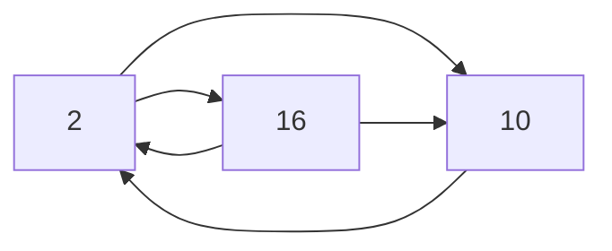

# Unité d'information

Représentation de l'information

---

## Unité d'information

- &shy;<!-- .element: class="fragment" --> Exemple d'information : 021 316 09 60
  - &shy;<!-- .element: class="fragment" --> **Encodé** en binaire : 0000 0010 0001 0011 0001 0110 0000 1001 0110 0000
  - &shy;<!-- .element: class="fragment" --> Longueur : 40 symboles
  - &shy;<!-- .element: class="fragment" --> 40 **bits** : **bi**nary digi**t**
- &shy;<!-- .element: class="fragment" --> 1 **bit** &nbsp;&nbsp;(b) : 0 ou 1
- &shy;<!-- .element: class="fragment" --> 1 **octet** (o) : 8 bits
- &shy;<!-- .element: class="fragment" --> 1 **byte** &nbsp;(B) : 8 bits (en anglais)
- &shy;<!-- .element: class="fragment" --> 8 Go = 8 GB = 64 Gb

---

## Préfixes décimaux d'unités (SI)

- &shy;<!-- .element: class="fragment" --> **kilo** &nbsp;(k) : 10<sup>3&nbsp;</sup> = 1 000
- &shy;<!-- .element: class="fragment" --> **méga** &nbsp;(M) : 10<sup>6&nbsp;</sup> = 1 000 000
- &shy;<!-- .element: class="fragment" --> **giga** &nbsp;(G) : 10<sup>9&nbsp;</sup> = 1 000 000 000
- &shy;<!-- .element: class="fragment" --> **téra** &nbsp;(T) : 10<sup>12</sup> = 1 000 000 000 000
- &shy;<!-- .element: class="fragment" --> péta &nbsp;(P) : 10<sup>15</sup> = 1 000 000 000 000 000
- &shy;<!-- .element: class="fragment" --> exa &nbsp;&nbsp;(E) : 10<sup>18</sup> = 1 000 000 000 000 000 000
- &shy;<!-- .element: class="fragment" --> zetta (Z) : 10<sup>21</sup> = 1 000 000 000 000 000 000 000

---

## Préfixes binaires d'unités

&shy;<!-- .element: class="fragment" --> 10<sup>3</sup> = 1000 **&approx;** 1024 = 2<sup>10</sup>

|    Préfixe    | Symbole |     Valeur      |    Préfixe    | Symbole |     Valeur     |
| :-----------: | :-----: | :-------------: | :-----------: | :-----: | :------------: |
| **kilo**octet | **k**o  | 10<sup>3</sup>  | **kibi**octet | **Ki**o | 2<sup>10</sup> |
| **méga**octet | **M**o  | 10<sup>6</sup>  | **mébi**octet | **Mi**o | 2<sup>20</sup> |
| **giga**octet | **G**o  | 10<sup>9</sup>  | **gibi**octet | **Gi**o | 2<sup>30</sup> |
| **téra**octet | **T**o  | 10<sup>12</sup> | **tébi**octet | **Ti**o | 2<sup>40</sup> |

<!-- .element: class="fragment" -->

---

## Préfixes binaires d'unités

- **kibi** (Ki) : 2<sup>10</sup> = 1 024
- **mébi** (Mi) : 2<sup>20</sup> = 1 048 576
- **gibi** (Gi) : 2<sup>30</sup> = 1 073 741 824
- **tébi** (Ti) : 2<sup>40</sup> = 1 099 511 627 776

---

## Hexadécimal (base 16)

- &shy;<!-- .element: class="fragment" --> 16 symboles (0-9, A-F)
- &shy;<!-- .element: class="fragment" --> Plus **compact** que le binaire
- &shy;<!-- .element: class="fragment" --> Conversion facilitée avec le **binaire**
  - &shy;<!-- .element: class="fragment" --> 2<sup>**4**</sup> = 16<sup>**1**</sup>
  - &shy;<!-- .element: class="fragment" --> **4** bits = **1** chiffre hexadécimal
- &shy;<!-- .element: class="fragment" --> 10 1010<sub>2</sub> = ?<sub>16</sub>
  - &shy;<!-- .element: class="fragment" -->
    ```katex
    \underbrace{0010}_{2}\ \underbrace{1010}_{A} = 2A_{16} = 2A_{hex}
    ```
- &shy;<!-- .element: class="fragment" --> 42<sub>16</sub> = 42<sub>**hex**</sub> = ?<sub>2</sub>
  - &shy;<!-- .element: class="fragment" -->
    ```katex
    \underbrace{4}_{0100}\ \underbrace{2}_{0010} = 0100\ 0010_{2}
    ```
- &shy;<!-- .element: class="fragment" --> 50B<sub>hex</sub> = ?<sub>2</sub>
  - &shy;<!-- .element: class="fragment" -->
    ```katex
    \underbrace{5}_{0101}\ \underbrace{0}_{0000}\ \underbrace{B}_{1011} = 0101\ 0000\ 1011_{2}
    ```

---

### Notations

|          &nbsp;          |          Base 2          |       Base 16        |
| :----------------------: | :----------------------: | :------------------: |
| Notation suffixée (math) |  101010<sub>**2**</sub>  | 2A<sub>**16**</sub>  |
| Notation suffixée (info) | 101010<sub>**bin**</sub> | 2A<sub>**hex**</sub> |
| Notation suffixée (info) |       101010**b**        |       2A**h**        |
| Notation préfixée (info) |       0**b**101010       |       0**x**2A       |

---

### Conversion entre bases 2, 10 et 16



---

## Encodage

Combien de bits as-t-on besoin pour encoder un chiffre ?

- &shy;<!-- .element: class="fragment" --> 10 **éléments** possibles : 0 à 9
- &shy;<!-- .element: class="fragment" --> **4** bits suffisent : 2<sup>**4**</sup> = 16

| Chiffre | Encodage |
| :-----: | :------: |
|    0    |   0000   |
|    1    |   0001   |
|    2    |   0010   |
|    3    |   0011   |
|   ...   |   ...    |
|    9    |   1001   |

<!-- .element: class="fragment" -->

- &shy;<!-- .element: class="fragment" --> 42 = 0100 0010
- &shy;<!-- .element: class="fragment" --> 3 bits insuffisants : 2<sup>3</sup> = 8

---

## Encodage

Combien de bits as-t-on besoin pour encoder une lettre ?

- &shy;<!-- .element: class="fragment" --> 26 **éléments** possibles : A à Z
- &shy;<!-- .element: class="fragment" --> **5** bits suffisent : 2<sup>**5**</sup> = 32

| Lettre | Encodage |
| :----: | :------: |
|   A    |  00000   |
|   B    |  00001   |
|   C    |  00010   |
|  ...   |   ...    |
|   Z    |  11001   |

<!-- .element: class="fragment" -->

- &shy;<!-- .element: class="fragment" --> BOB = 00001 01110 00001
- &shy;<!-- .element: class="fragment" --> Minuscules/majuscules, accents, etc. ?
