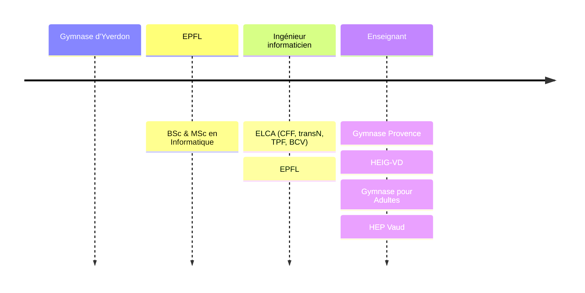

# Informatique 3CCI

David Tang

---

## Parcours

---

## Organisation

- **Cours** et **Travaux pratiques**
  - 2 périodes / semaine

---

## Présence

- &shy;<!-- .element: class="fragment" --> **Retard**
  - Être **prêt·e** à suivre le cours à la **sonnerie**
- &shy;<!-- .element: class="fragment" --> **Absence**
  - À partir de quinze minutes de retard
- &shy;<!-- .element: class="fragment" --> **Prévenir** par mail en cas d'**absence**
  - &shy;<!-- .element: class="fragment" --> Sinon pas de rattrapage de test

---

## Prise de notes

- &shy;<!-- .element: class="fragment" --> **Supports** mis à disposition
- &shy;<!-- .element: class="fragment" --> Prendre des notes pour **compléter** les diapositives

---

## Vos attentes

Pourquoi avoir choisi ce domaine professionnel ?

---

## Contenu

[Plan d'études](https://www.vd.ch/fileadmin/user_upload/organisation/dfj/dgep/dgep_fichiers_pdf/DGEP_brochure_ECG_WEB.pdf)

- &shy;<!-- .element: class="fragment" --> Pages Web **statiques**
- &shy;<!-- .element: class="fragment" --> Page Web **dynamiques**
- &shy;<!-- .element: class="fragment" --> **Algorithmique** et **programmation** avancée
- &shy;<!-- .element: class="fragment" --> Des données à l'**information**

---

## Teams

- &shy;<!-- .element: class="fragment" --> Poser les **questions générales** sur Teams
  - Réponses pour **toute** la classe
- &shy;<!-- .element: class="fragment" --> **Supports de cours** spécifiques à la classe
  - Notes

---

## [gymnase.davidtang.ch](https://gymnase.davidtang.ch/)

- &shy;<!-- .element: class="fragment" --> **Calendrier**
  - Dates des **tests**
- &shy;<!-- .element: class="fragment" --> **Supports** de cours
- &shy;<!-- .element: class="fragment" --> **Enregistrer** le lien
  - Ajouter à l'écran d'accueil
  - Ajouter aux favoris
