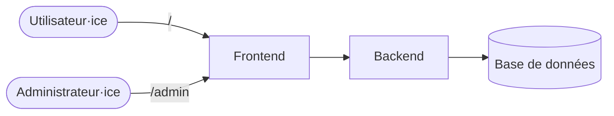

# CMS

Pages Web dynamiques

---

## CMS

- Content Management System (**CMS**) : Système de gestion de contenu (SGC)
- &shy;<!-- .element: class="fragment" --> Permet de **gérer** (créer, modifier, supprimer) le **contenu** d'un site web
- &shy;<!-- .element: class="fragment" --> Séparation du **contenu** et de la **présentation**
  - &shy;<!-- .element: class="fragment" --> Gestion du contenu **non technique**
  - &shy;<!-- .element: class="fragment" --> Gestion de la présentation par des **templates**
- &shy;<!-- .element: class="fragment" --> Portail d'**administration** pour les **utilisateurs**
- &shy;<!-- .element: class="fragment" --> Exemples : WordPress, Joomla, Drupal, &hellip;

---

## CMS

- &shy;<!-- .element: class="fragment" --> **Utilisateur·ice** : Visite le site
- &shy;<!-- .element: class="fragment" --> **Administrateur·ice** : Gère le site à travers un chemin restreint (pas tout le monde peut accéder à `/admin`)
- &shy;<!-- .element: class="fragment" --> **Frontend** : Partie client (visible) du site
- &shy;<!-- .element: class="fragment" --> **Backend** : Partie serveur du site
- &shy;<!-- .element: class="fragment" --> **Base de données** : Stockage des données

---

## WYSIWYG

- **WYSIWYG** (What You See Is What You Get) : ce que vous voyez est ce que vous obtenez (CQVVECQVO)
- &shy;<!-- .element: class="fragment" --> Éditeur de texte où on voit le **rendu** final
- &shy;<!-- .element: class="fragment" --> Exemples : Microsoft Office, LibreOffice, Google Docs, &hellip;
- &shy;<!-- .element: class="fragment" --> Contre-exemples : HTML, Markdown, &hellip;

---

## Markdown

- &shy;<!-- .element: class="fragment" --> **Langage** de balisage léger
  - &shy;<!-- .element: class="fragment" --> Syntaxe **facile** à lire et à écrire
- &shy;<!-- .element: class="fragment" --> [Dillinger](https://dillinger.io/)
