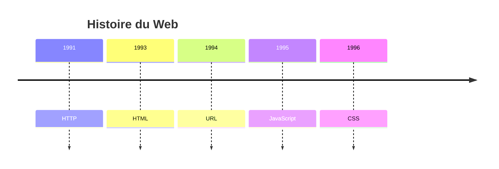

# JavaScript

Pages Web dynamiques

---



---

## JavaScript

 <!-- .element: class="full" -->

<p class="reference">
  <a href="https://commons.wikimedia.org/wiki/File:Unofficial_JavaScript_logo_2.svg">Christopher Williams</a>, Public domain, via Wikimedia Commons
</p>

---

## JavaScript

- &shy;<!-- .element: class="fragment" --> **Java** + **Script**
  - &shy;<!-- .element: class="fragment" --> Proche de **Java** uniquement au niveau **syntaxique** ! (pas de typage, ni de compilation, ni de JVM)
  - &shy;<!-- .element: class="fragment" --> Popularité de Java à l'époque de la création de JavaScript (**1995**) &rarr; marketing
- &shy;<!-- .element: class="fragment" --> Typage **dynamique** et **faible** (comme Python)
- &shy;<!-- .element: class="fragment" --> **Versions** : ES5 (2009), ES6 (2015), ES7 (2016), etc. (ECMAScript)

---

### DOM (Document Object Model)


<p class="reference">
  <a href="https://commons.wikimedia.org/wiki/File:DOM-model.svg">‍Birger Eriksson</a>, <a href="https://creativecommons.org/licenses/by-sa/3.0">CC BY-SA 3.0</a>, via Wikimedia Commons
</p>

- &shy;<!-- .element: class="fragment" --> Représentation **arborescente** des éléments HTML
- &shy;<!-- .element: class="fragment" --> **API** (interface) pour **manipuler** le DOM (ajouter, supprimer, modifier des éléments) utilisée par JavaScript
- &shy;<!-- .element: class="fragment" --> **Événements** : réagir à des actions de l'utilisateur (clic, survol, etc.)

---

## JavaScript inline

```html
<!doctype html>
<html>
  <head>
    <title>Page Web</title>
    <script>
      function creerParagraphe() {
        let p = document.createElement("p"); // Créer <p>
        p.textContent = "Clic !"; // <p>Clic !</p>
        document.body.appendChild(p); // Ajouter <p> à <body>
      }
    </script>
  </head>
  <body>
    <button onclick="creerParagraphe()">Cliquez ici</button>
  </body>
</html>
```

[Démonstration](https://codepen.io/blueur/pen/RNbbGBE?editors=1010)

---

## JavaScript externe

index.html :

```html
<!doctype html>
<html>
  <head>
    <title>Page Web</title>
    <script src="script.js"></script>
  </head>
  <body>
    <button onclick="creerParagraphe()">Cliquez ici</button>
  </body>
</html>
```

---

## JavaScript externe

script.js :

```javascript
function creerParagraphe() {
  let p = document.createElement("p");
  p.textContent = "Clic !";
  document.body.appendChild(p);
}
```
