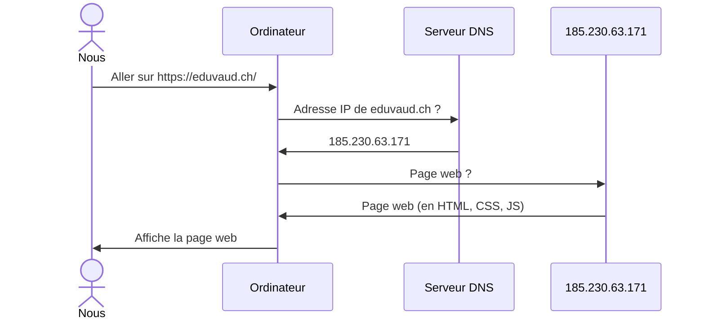

# Nom de domaine

Pages Web statiques

---

## Nom de domaine

- &shy;<!-- .element: class="fragment" --> Plus **lisible** et **facile à retenir** qu'une adresse IP
  - eduvaud.ch &rarr; 185.230.63.171
  - office.com &rarr; 13.107.6.156
  - localhost &rarr; 127.0.0.1
- &shy;<!-- .element: class="fragment" --> **Louable** auprès d'un **registraire** (ex. Infomaniak, OVH, ...)
  - .ch coûte ~10.-/an
  - .com coûte ~15.-/an
  - https://www.infomaniak.com/fr/domaines

---

## Structure d'un nom de domaine

```katex
\underbrace{\text{www}}_{\text{sous-domaine}}.\underbrace{\text{exemple}}_{\text{nom de domaine}}.\underbrace{\text{com}}_{\text{extension}}
```

- &shy;<!-- .element: class="fragment" --> **extension** (domaine de premier niveau)
  - &shy;<!-- .element: class="fragment" --> .ch, .fr, .com, .org, .edu, ...
- &shy;<!-- .element: class="fragment" --> **Nom de domaine** (domaine de deuxième niveau)
  - &shy;<!-- .element: class="fragment" --> 1 seul
- &shy;<!-- .element: class="fragment" --> **Sous-domaine** (domaine de troisième niveau)
  - &shy;<!-- .element: class="fragment" --> 0, 1 ou plusieurs
- &shy;<!-- .element: class="fragment" --> gymnase.davidtang.ch ?

---

## DNS (Système de nom de domaine)

- &shy;<!-- .element: class="fragment" --> **D**omain **N**ame **S**ystem
- &shy;<!-- .element: class="fragment" --> **Traduction** des noms de domaine en adresses IP
- &shy;<!-- .element: class="fragment" --> Aller sur https://eduvaud.ch/
  - &shy;<!-- .element: class="fragment" --> L'ordinateur demande à un serveur DNS l'adresse IP de eduvaud.ch
  - &shy;<!-- .element: class="fragment" --> Le serveur DNS répond 185.230.63.171
  - &shy;<!-- .element: class="fragment" --> L'ordinateur demande la page web de 185.230.63.171

---

## Séquence page web



---

> Dear user,
>
> Your facebook account has been locked out due to inactivity.
> To re-activate your account please click on the link below:
>
> https://activate.facebook.fblogins.net/88adbao798283o8298398/login.html

---

## Usurpation de domaine

- &shy;<!-- .element: class="fragment" --> Hameçonnage (Phishing)
  - &shy;<!-- .element: class="fragment" --> Envoyer un email avec un lien vers un faux site (imitation)
  - &shy;<!-- .element: class="fragment" --> Nom de domaine similaire au vrai (typo, ...)
- &shy;<!-- .element: class="fragment" --> **Vérifier** si on peut faire confiance au nom de **domaine**
  - &shy;<!-- .element: class="fragment" --> [PhishTank](https://www.phishtank.com/index.php) : base de données de sites de phishing <!-- .element: target="_blank" -->

---

## Adresse email

```katex
\underbrace{\text{prenom.nom}}_{\text{partie locale}}\text{@}\underbrace{\text{eduvaud.ch}}_{\text{nom de domaine}}
```
