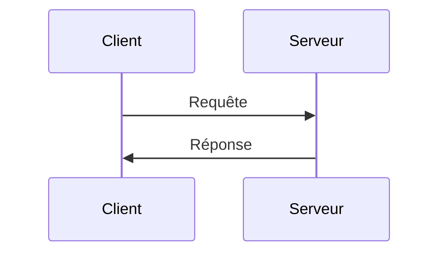
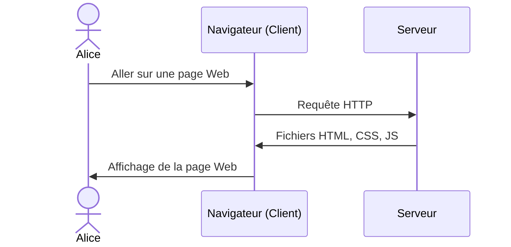

# HTML

Pages Web statiques

---

## Afficher une page Web



---

## Le navigateur Web



---

## Les langages Web

- &shy;<!-- .element: class="fragment" --> **HTML**
  - &shy;<!-- .element: class="fragment" --> Hypertext Markup Language
  - &shy;<!-- .element: class="fragment" --> **Structure** de la page
- &shy;<!-- .element: class="fragment" --> **CSS**
  - &shy;<!-- .element: class="fragment" --> Cascading Style Sheets
  - &shy;<!-- .element: class="fragment" --> **Mise en forme** de la page
- &shy;<!-- .element: class="fragment" --> **JS**
  - &shy;<!-- .element: class="fragment" --> JavaScript
  - &shy;<!-- .element: class="fragment" --> **Interactivité** de la page

---

## HTML

```html
<!doctype html>
<html lang="fr">
  <head>
    <meta charset="UTF-8" />
    <meta name="viewport" content="width=device-width, initial-scale=1" />
    <title>Page Web</title>
  </head>
  <body>
    <h1>Titre de la page</h1>
    <p>Contenu de la page</p>
  </body>
</html>
```

- &shy;<!-- .element: class="fragment" --> Langage de balisage
- &shy;<!-- .element: class="fragment" --> Fichier `.html`

---

## Balises HTML


https://developer.mozilla.org/fr/docs/Learn/Getting_started_with_the_web/HTML_basics <!-- .element: class="reference" target="_blank" -->

---

## Attributs HTML


https://developer.mozilla.org/fr/docs/Learn/Getting_started_with_the_web/HTML_basics <!-- .element: class="reference" target="_blank" -->

---

## Structure de base


https://openclassrooms.com/fr/courses/1603881-creez-votre-site-web-avec-html5-et-css3/8061261-creez-votre-premiere-page-web-en-html <!-- .element: class="reference" target="_blank" -->
