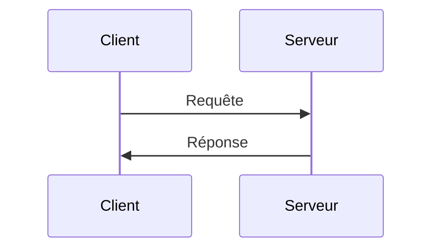
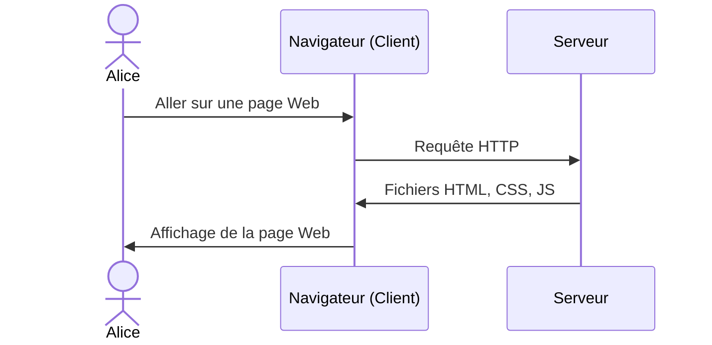

# HTML

Pages Web statiques

---

# Afficher une page Web

```mermaid
sequenceDiagram
  Client->>Serveur: Requête
  Serveur->>Client: Réponse
```

---

```mermaid
sequenceDiagram
  actor A as Alice
  participant C as Navigateur (Client)
  participant S as Serveur
  A->>C: Aller sur une page Web
  C->>S: Requête HTTP
  S->>C: Fichiers HTML, CSS, JS
  C->>A: Affichage de la page Web
```

---
