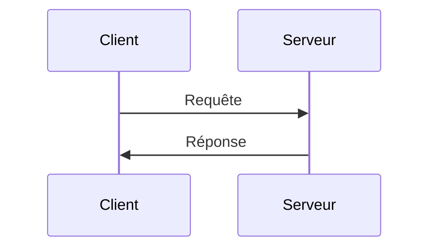
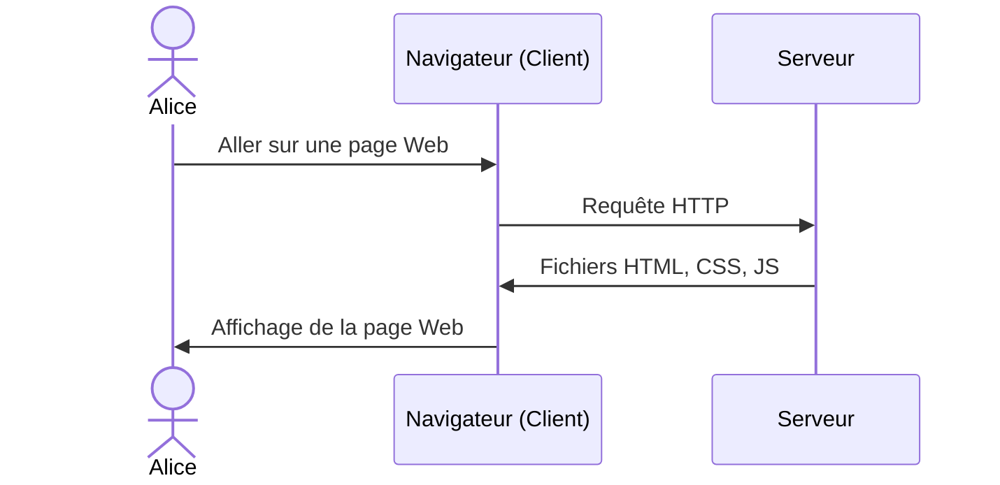

# HTML

Pages Web statiques

---

## Afficher une page Web



---

## Le navigateur Web



---

## Les langages Web

- &shy;<!-- .element: class="fragment" --> **HTML**
  - &shy;<!-- .element: class="fragment" --> **H**yper**t**ext **M**arkup **L**anguage
  - &shy;<!-- .element: class="fragment" --> **Structure** de la page
- &shy;<!-- .element: class="fragment" --> **CSS**
  - &shy;<!-- .element: class="fragment" --> **C**ascading **S**tyle **S**heets
  - &shy;<!-- .element: class="fragment" --> **Mise en forme** de la page
- &shy;<!-- .element: class="fragment" --> **JS**
  - &shy;<!-- .element: class="fragment" --> **J**ava**S**cript
  - &shy;<!-- .element: class="fragment" --> **Interactivité** de la page

---

## HTML

```html
<!doctype html>
<html lang="fr">
  <head>
    <meta charset="UTF-8" />
    <meta name="viewport" content="width=device-width, initial-scale=1" />
    <title>Page Web</title>
  </head>
  <body>
    <h1>Titre de la page</h1>
    <p>Contenu de la page</p>
  </body>
</html>
```

- &shy;<!-- .element: class="fragment" --> Langage de balisage
- &shy;<!-- .element: class="fragment" --> Fichier `.html`
- &shy;<!-- .element: class="fragment" --> `index.html` : Page d'accueil

---

## Balises HTML


https://developer.mozilla.org/fr/docs/Learn/Getting_started_with_the_web/HTML_basics <!-- .element: class="reference" target="_blank" -->

---

## Élément vide

```html

</img>

<!-- équivalent à -->


```

---

## Commentaires

```html
<!-- Voici la balise pour les commentaires -->
```

- &shy;<!-- .element: class="fragment" --> Ne s'**affiche pas**
- &shy;<!-- .element: class="fragment" --> Permets d'ajouter des **notes** explicatives dans le code
  - &shy;<!-- .element: class="fragment" --> Pour les **autres** développeurs
  - &shy;<!-- .element: class="fragment" --> Pour son futur **soi**

---

## Attributs HTML


https://developer.mozilla.org/fr/docs/Learn/Getting_started_with_the_web/HTML_basics <!-- .element: class="reference" target="_blank" -->

---

## Structure de base


https://openclassrooms.com/fr/courses/1603881-creez-votre-site-web-avec-html5-et-css3/8061261-creez-votre-premiere-page-web-en-html <!-- .element: class="reference" target="_blank" -->

---

## Structure de base

```html
<!doctype html>
<html lang="fr">
  <head>
    <meta charset="UTF-8" />
    <meta name="viewport" content="width=device-width, initial-scale=1" />
    <title>Page Web</title>
  </head>
  <body>
    <h1>Titre de la page</h1>
    <p>Contenu de la page</p>
  </body>
</html>
```

---

## Structure de base

- `<!doctype html>` : Déclaration du type de document (HTML5)
- `<html>` : Élément racine
  - `lang="fr"` : Langue de la page
- `<head>` : Métadonnées (informations sur la page qui ne s'affichent pas)
  - `charset="UTF-8"` : Encodage des caractères
  - `viewport` : Affichage sur les appareils mobiles
  - `title` : Titre de la page (onglet)
- `<body>` : Contenu de la page
  - `h1` : Titre principal
  - `p` : Paragraphe

---

## URL


https://developer.mozilla.org/en-US/docs/Learn/Common_questions/Web_mechanics/What_is_a_URL <!-- .element: class="reference" target="_blank" -->

- &shy;<!-- .element: class="fragment" --> **U**niform **R**esource **L**ocator
- &shy;<!-- .element: class="fragment" --> **Adresse** d'une **ressource** sur Internet
